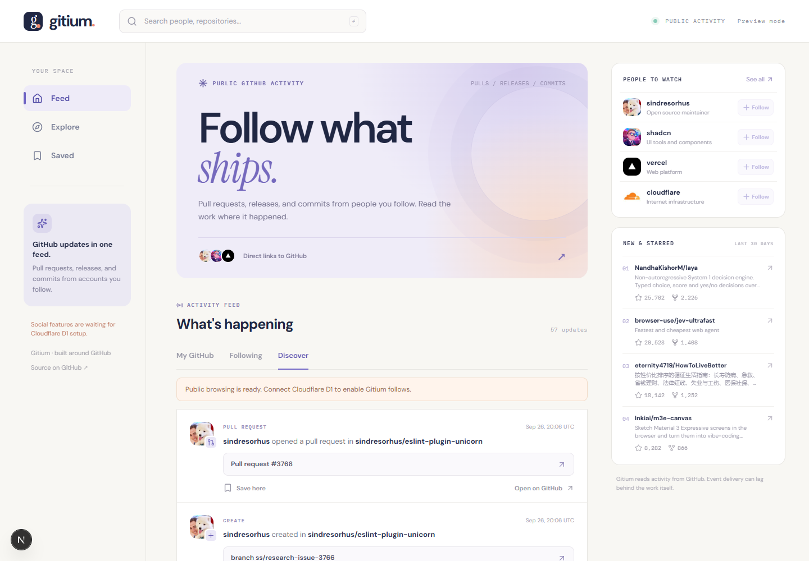

# Gitium

### Find your next GitHub project.

Find useful GitHub projects and the organizations behind them. Browse by language and topic, explore their commit history, and find something to contribute to.

[Explore Gitium](https://gitium.vercel.app) · [Meet the maker](https://manasraj.vercel.app)

## Find projects through people

Start with **top projects** ranked by stars, forks or recent updates. Search by language, topic, owner and creation date, or browse organizations by followers and repository count. Every filtered page has a shareable URL.

The **Essentials** collection explains what each selected tool is useful for and what to consider before using it. It is a curated starting point, with links to explore the code and find open issues.

Your GitHub follows are your starting point. Gitium brings together the repositories they recently starred and shows exactly who found each one. When several people in your circle pick the same project, you can see the overlap. Follow or unfollow someone in Gitium and the change appears on GitHub too.

## See the code behind an account

Open any GitHub profile to see a year of contributions, its recent repository languages, and the most starred projects in the sample. Open a public repository to graph its recent commit cadence, contributors, and changes. Gitium also gives every account an **illustrative dollar estimate** using a visible formula based on contributions, followers, stars, and repositories. It is a way to compare public activity, not a sale price or financial valuation. A local history in your browser lets you see how an estimate changes over time.

## Find an issue

Browse open GitHub issues by language, repository, recent activity, and the project’s **good first issue** or **help wanted** labels. Filter for unassigned work, read the details, and go directly to the original issue. Check with the maintainers before starting.

## Give work a place to talk

- **Private rooms:** invite people into repository and organization chats.
- **Direct chat:** send a request. The recipient accepts or declines before messages unlock. Cancel pending requests or block someone at any time.

Room invitations have Join and Decline controls. Direct chats require mutual consent, and a declined request cannot be sent again by its original sender. Blocking stops DMs and new invitations between the two accounts. Existing shared rooms keep their membership rules; leave a room to stop participating there. Repository and organization rooms are created by Gitium users and are not official GitHub-managed spaces.

Chats are **not yet end-to-end encrypted**; Gitium's server processes message text.

## Bring your stars along

Open your library to import GitHub stars, filter the list, and explore a repository's code graph. Your star list is read from GitHub rather than copied into Gitium's database.

## See what people are exploring

Code and account leaderboards show the top ten for today, seven days, thirty days, or a year. Repository rankings count one signed-in exploration per person per repository each day. Account rankings use computed score snapshots, including deductions for stale projects, forks, and concentrated stars.

## Keep up without losing the source

Browse recent work from your GitHub network, save useful links in your browser, and open the original commit, issue, pull request, release, or repository on GitHub. Gitium shows where a project came from and lets you decide what matters.

## Your account, your view

Gitium reads public project and account information from GitHub when you use it. It stores your Gitium conversations so participants can read and reply, while saved links and estimate history stay in your browser. Light and dark themes are built in.

---

**Gitium** is made by [Manas Raj](https://manasraj.vercel.app).
